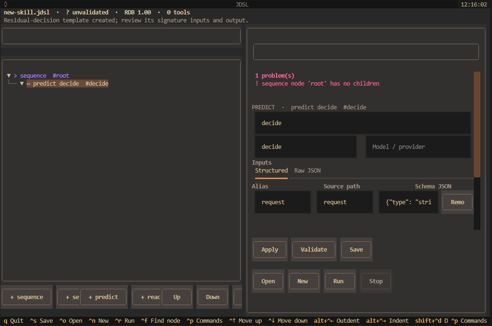

# JDSL TUI

The TUI is the primary authoring surface for building and validating restricted
Behavior IR packages. It covers the day-to-day flow of creating a skill, editing
node structure and properties, validating that the tree remains coherent, and
running a tool-backed skill in a safe, traceable way.

<p align="center">
  
</p>

## Workbench overview

The workbench is laid out around a few clear regions:

- a tree view on the left showing the current skill structure,
- a property inspector on the right for the selected node,
- a validation and status area for warnings and recovery hints,
- a run panel for tool imports, inputs, and execution tracing,
- a command palette and keyboard bindings for fast editing.

The app retains a compact terminal-first layout, so it is designed to work well
in real terminals without wasting vertical space on oversized chrome.

## Start the TUI

Install the optional TUI dependency:

```bash
pip install 'jdsl[tui]'
jdsl tui
```

From a checkout:

```bash
uv sync
uv run --extra tui jdsl tui
```

## Author a skill

Launching `jdsl tui` opens a blank or previously opened skill directly into the
workbench. From there you can:

- select a node and edit its id, type, tools, guards, model hints, and metadata,
- add children from the node palette or command palette,
- reorder, indent, outdent, duplicate, and copy/paste subtrees,
- review validation warnings and structural quality hints before saving.

Supported node types include sequence, selector, action, guard, predict, react,
and repeat. Predict and react nodes expose signature-related metadata, provider
hints, output names, instructions, and tool sets in the inspector.

The **New** action offers four starting points: a blank skill, lookup then act,
model decision, and guarded write. The inspector changes with the selected node;
action arguments, guard expressions, signatures, and run inputs have structured
editors with a **Raw JSON** view for values that need direct editing.

Use **Definitions** to edit each logical tool capability's description,
arguments, and effect (`read-only`, `write`, or `destructive`). Its Signatures
tab shows declared signatures and where they are used. Edit signature details
from the inspector of a predict or react node.

## Save, open, and new flows

The app is designed around safe editing and recovery:

- **Save** writes a portable `.jdsl` package and reloads it to confirm the
  serialized artifact remains valid,
- **Open** loads a verified package,
- **New** creates one of the available templates,
- unsaved changes prompt before discard or close,
- recently opened packages are available in the workbench,
- a recovery draft is autosaved while editing and can be restored after an
  interrupted session.

The output is restricted Behavior IR and capability contracts rather than raw
Python logic, so the package structure stays intentionally constrained.

## Validation and quality checks

The TUI runs the same structural checks used by the package loader, and keeps
validation feedback visible in the inspector while editing. Checks include:

- malformed subtree checks,
- missing or invalid node fields,
- capability and signature consistency warnings,
- quality hints, such as a destructive action without an earlier guard.

Validation errors prevent saving or running the package. Quality hints are
reported separately so they can inform editing without acting as structural
validation failures.

## Run and trace execution

**Run** accepts a Python tools module exposing `TOOLS` and an optional
`PREDICATES` mapping. Inputs are generated from unresolved blackboard refs and
can be edited as key/value fields or raw JSON. Input values are remembered for
the current skill.

Before importing the module, the workbench asks for approval and displays its
path and SHA-256 digest. Approval is remembered for that path and exact content;
changing the file requires a new approval. Runs execute in a worker thread so
the UI remains responsive. The run panel shows progress, node status, and trace
summaries, but does not log tool arguments or results. The final blackboard is
shown with common secret patterns redacted.

Enable **Dry run** to report intended tool calls without invoking the tools.
The approved module is still imported, so dry run is not a sandbox and the
module itself must be trusted. **Stop** requests cancellation between runtime
operations.

## Security and trust model

The TUI requires explicit consent before importing a local tools module and
rechecks its content digest after approval. This is a trust prompt, not process
isolation: imported Python code runs with the user's permissions. Only approve
modules you trust. Packages contain restricted Behavior IR and capability
contracts; they do not bundle arbitrary Python tool implementations.

## Keyboard and commands

The command palette is available with `Ctrl+P`. It includes node creation,
validation, definitions, package actions, dry-run toggle, and recent packages.
The main keyboard bindings are:

| Shortcut | Action |
| --- | --- |
| `Ctrl+S` | Save |
| `Ctrl+O` | Open |
| `Ctrl+N` | New from template |
| `Ctrl+R` | Run |
| `Escape` | Stop run |
| `Ctrl+F` | Find node by ID or type |
| `Ctrl+Up` / `Ctrl+Down` | Move among siblings |
| `Ctrl+Alt+Left` / `Ctrl+Alt+Right` | Outdent / indent |
| `Ctrl+Shift+D` | Duplicate subtree |
| `Ctrl+Shift+C` / `Ctrl+Shift+V` | Copy / paste subtree |
| `Ctrl+Z` / `Ctrl+Shift+Z` | Undo / redo |
| `Ctrl+P` | Open command palette |
| `Ctrl+M` | Toggle reduced motion |
| `Ctrl+G` | Switch ASCII and Unicode glyphs |
| `F1` | Open help and shortcuts |
| `q` | Quit |

The workbench requires a terminal at least 80 columns by 24 rows. If the
terminal is smaller, it displays a resize warning instead of the editor.

## Implementation notes

The app, theme, settings, run panel, trust dialog, and workbench are grouped in
`jdsl/tui/`. `jdsl.tui_skill` remains as a compatibility import for older
callers, and the workbench remains intentionally scoped to authoring rather than
capture-console orchestration.

Harness capture and compilation remain available through the commands documented
in [Harness Usage](harness_usage.md). They are intentionally separate from the
TUI authoring workflow while the skill editor continues to evolve.
